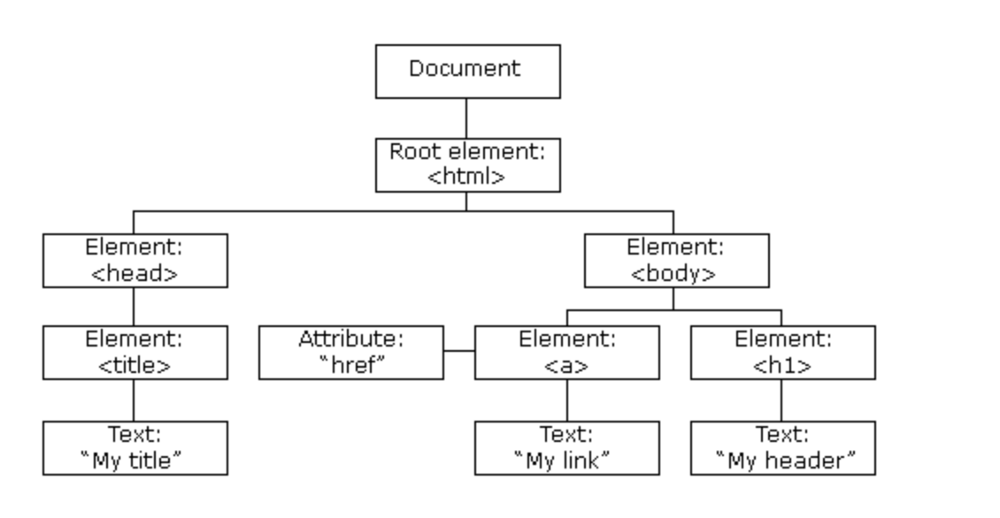

# 10. DOM Nodes

Created By: 홍익 안
Last Edited: Nov 25, 2020 8:08 PM

# DOM Nodes

According to the W3C HTML DOM standard, everything in an HTML document is a node:

- The entire document is a document node
- Every HTML element is an element node
- The text inside HTML elements are text nodes
- Every HTML attribute is an attribute node (deprecated)
- All comments are comment nodes



With the HTML DOM, all nodes in the node tree can be accessed by JavaScript.

New nodes can be created, and all nodes can be modified or deleted.

# Node Relationships

The nodes in the node tree have a hierarchical relationship to each other.

The terms parent, child, and sibling are used to describe the relationships.

- In a node tree, the top node is called the root (or root node)
- Every node has exactly one parent, except the root (which has no parent)
- A node can have a number of children
- Siblings (brothers or sisters) are nodes with the same parent


From the HTML above you can read:

- `<html>` is the root node
- `<html>` has no parents
- `<html>` is the parent of `<head>` and `<body>`
- `<head>` is the first child of `<html>`
- `<body>` is the last child of `<html>`

and:

- `<head>` has one child: `<title>`
- `<title>` has one child (a text node): "DOM Tutorial"
- `<body>` has two children: `<h1>` and `<p>`
- `<h1>` has one child: "DOM Lesson one"
- `<p>` has one child: "Hello world!"
- `<h1>` and `<p>` are siblings

# Navigating Between Nodes

You can use the following node properties to navigate between nodes with JavaScript:

- `parentNode`
- `childNodes[*nodenumber*]`
- `firstChild`
- `lastChild`
- `nextSibling`
- `previousSibling`

# Child Nodes and Node Values

A common error in DOM processing is to expect an element node to contain text.

```html
<title id="demo">DOM Tutorial</title>
```

The element node `<title>` (in the example above) does **not** contain text.

It contains a **text node** with the value "DOM Tutorial".

The value of the text node can be accessed by the node's `innerHTML` property:

```jsx
var myTitle = document.getElementById("demo").innerHTML;
```

Accessing the innerHTML property is the same as accessing the nodeValue of the first child:

```jsx
var myTitle = document.getElementById("demo").firstChild.nodeValue;
```

Accessing the first child can also be done like this:

```jsx
var myTitle = document.getElementById("demo").childNodes[0].nodeValue;
```

All the (3) following examples retrieves the text of an h1 element and copies it into a p element:

```html
<!DOCTYPE html>
<html>
  <body>
    <h1 id="id01">My First Page</h1>
    <p id="id02"></p>

    <script>
      // ex1
      document.getElementById("id02").innerHTML = document.getElementById(
        "id01"
      ).innerHTML;
      // ex2
      document.getElementById("id02").innerHTML = document.getElementById(
        "id01"
      ).firstChild.nodeValue;
      // ex3
      document.getElementById("id02").innerHTML = document.getElementById(
        "id01"
      ).childNodes[0].nodeValue;
    </script>
  </body>
</html>
```

# InnerHTML

In this tutorial we use the innerHTML property to retrieve the content of an HTML element.

However, learning the other methods above is useful for understanding the tree structure and the navigation of the DOM.

# DOM Root Nodes

There are two special properties that allow access to the full document:

- `document.body` - The body of the document
- `document.documentElement` - The full document

[Tryit Editor v3.6](https://www.w3schools.com/js/tryit.asp?filename=tryjs_dom_body)

[Tryit Editor v3.6](https://www.w3schools.com/js/tryit.asp?filename=tryjs_dom_document)

# The nodeName Property

The `nodeName` property specifies the name of a node.

- nodeName is read-only
- nodeName of an element node is the same as the tag name
- nodeName of an attribute node is the attribute name
- nodeName of a text node is always #text
- nodeName of the document node is always #document

[Tryit Editor v3.6](https://www.w3schools.com/js/tryit.asp?filename=tryjs_dom_nav_nodename)

Note: nodeName always contains the uppercase tag name of an HTML element.

# The nodeValue Property

The `nodeValue` property specifies the value of a node.

- nodeValue for element nodes is `null`
- nodeValue for text nodes is the text itself
- nodeValue for attribute nodes is the attribute value

# The nodeType Property

The `nodeType` property is read only. It returns the type of a node.

[Tryit Editor v3.6](https://www.w3schools.com/js/tryit.asp?filename=tryjs_dom_nav_nodetype)


Type 2 is deprecated in the HTML DOM (but works). It is not deprecated in the XML DOM.

출처:

[Nodes vs Elements in the DOM](https://issabmsangare.medium.com/nodes-vs-elements-in-the-dom-1865885d0b9b)

[JavaScript DOM Navigation](https://www.w3schools.com/js/js_htmldom_navigation.asp)
