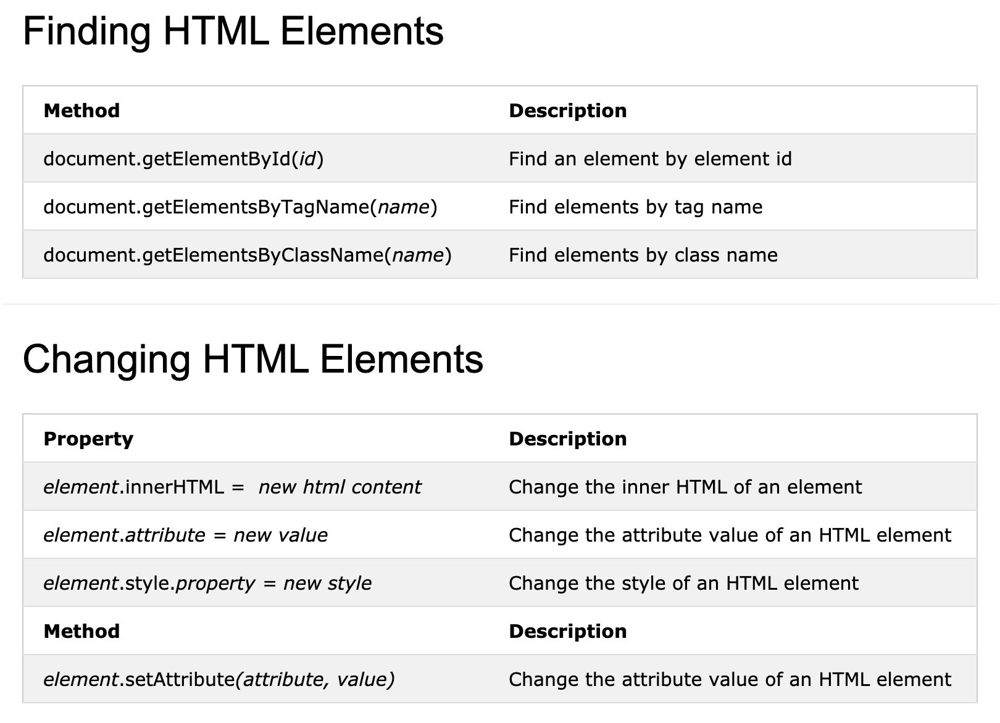

# 3. HTML DOM Document

Created By: 홍익 안
Last Edited: Nov 25, 2020 6:36 PM

# The HTML DOM Document Object

The document object represents your web page.

If you want to access any element in an HTML page, you always start with accessing the document object.

Below are some examples of how you can use the document object to access and manipulate HTML.

출처:

[W3Schools Online Web Tutorials](https://www.w3schools.com/)
