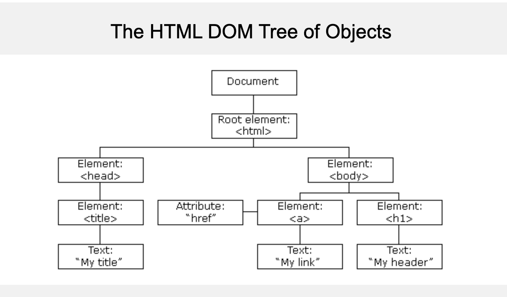

# 1. HTML DOM-Intro

Created By: 홍익 안
Last Edited: Nov 25, 2020 6:36 PM

## HTML DOM(Document Object Model)

When a web page is loaded, the browser creates a **D**ocument **O**bject **M**odel of the page.

The **HTML DOM** model is constructed as a tree of **Objects**:

With the object model, JavaScript gets all the power it needs to create dynamic HTML:

- JavaScript can change all the HTML elements in the page
- JavaScript can change all the HTML attributes in the page
- JavaScript can change all the CSS styles in the page
- JavaScript can remove existing HTML elements and attributes
- JavaScript can add new HTML elements and attributes
- JavaScript can react to all existing HTML events in the page
- JavaScript can create new HTML events in the page

**The HTML DOM is a standard for how to get, change, add, or delete HTML elements.**

출처:

[W3Schools Online Web Tutorials](https://www.w3schools.com/)
